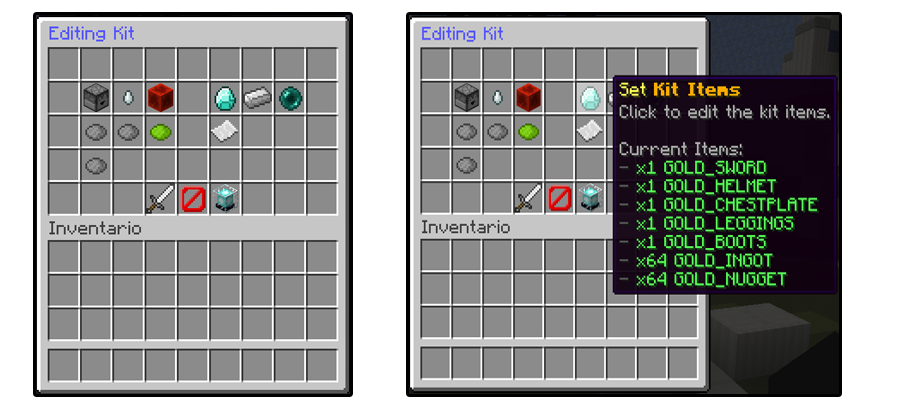

# PlayerKits

Ajneb's plugin page
at [SpigotMC](https://www.spigotmc.org/resources/playerkits-fully-configurable-kits-1-8-1-17.75185/),
and [original source](https://github.com/Ajneb97/PlayerKits).

---

## Fork

My intention with this fork is NOT to maintain the plugin, it's just a version that I could use in my own testing server
environment.

I could probably accept some feature & pull requests, I'm also looking to fix errors so issues section is available.

---

### **DISCLAIMER**

**ℹ THIS PROJECT IS IN BEING RECODED, FEATURES, FUNCTIONS, PREVIOUS CONFIG MAY NOT WORK!**
<br>
**⚠ USE AT YOUR OWN WILL ⚠**
<br>

**ℹ THIS PROJECT IS IN BEING RECODED, FEATURES, FUNCTIONS, PREVIOUS CONFIG MAY NOT WORK!**
<br>
**⚠ USE AT YOUR OWN WILL ⚠**
<br>

---


### What can I do with PlayerKits?

This plugin allows you to create a variety of kits and put them on a GUI Inventory.
<br>
Using <span style="color:red">/kit</span> players will be able to claim these kits if they have the correct permission.
<br>
Kits can also have a cooldown, so users can't claim them everytime.

What makes **<span style="color:yellow">Player</span><span style="color:light_gray">Kits</span>** special is its easy
way to create kits, just having the items on your inventory and executing a
command.
<br>
You can edit kits properties by using <span style="color:red">/kit edit</span> command.
<br>
Also, almost all item attributes will be stored in the kit, so they are given correctly.

<details>
<summary>Features</summary>

- ✓ GUI Inventory to claim Kits.
- ✓ Command to claim Kits.
- ✓ Configurable display item in GUI:​

  Item, name, lore.
  Different item when player doesn't have permission.
  Different item when player hasn't buyed the kit.
  Different lore when kit is in cooldown.

- ✓ Cooldown for kits.
- ✓ Permissions for kits.
- ✓ Price for kits.
- ✓ One Time Buy kits
- ✓ Execute commands when giving a kit.
- ✓ Customizable Kit Preview.
- ✓ Pages System.
- ✓ Edit Kits from Game.
- ✓ First join kit.
- ✓ One time use kit.
- ✓ 1.16 HEX Color support for kit items.
- ✓ Auto Armor Equip.
- ✓ Auto Offhand item Equip.
- ✓ Configurable GUI.
- ✓ MySQL support for player data.
- ✓ Kits will save Item Attributes.
    - Name, Lore.
    - %player% variable in name and lore.
    - PlaceholderAPI static variables in name and lore.
    - Enchantments.
    - Potion Effects.
    - Leather Armor Color.
    - Book Enchantments.
    - Written Books.
    - Fireworks Attributes.
    - Banner, Shields Attributes.
    - Skull Textures.
    - Item Flags.
    - Unbreakable Tag.
    - Attributes Modifiers.
    - NBT Tags.

- ✓ Works in 1.8+.
- ✓ Messages translation.

</details>

### How to Start

To create a new kit you just need to have some items on your inventory and then execute the command `/kit create <name>`.


To claim the kit you have two options.
1) Use the `/kit` command and click on the kit item inside the GUI.
2) Use the `/kit claim <name>` command.
> ℹ Or use `/kit <name>` if you have `claim_kit_short_command` option set to `true`


You can also edit the kit directly from Minecraft without touching the config, using the `/kit edit <kit>` command.



---

### More

  <details>
  <summary>Config options</summary>

<!> Please don't use this, it needs to get updated.

  ```yaml
# Here you can define the sound name for specific events. 
# Use these sounds for 1.8: https://github.com/Attano/Spigot-1.8/blob/master/org/bukkit/Sound.java
# And these sounds for newer versions: https://hub.spigotmc.org/javadocs/spigot/org/bukkit/Sound.html
# Format: Sound;Volume;Pitch
# You can set the options to 'none' for not setting any sound.
kit_error_sound: BLOCK_NOTE_BLOCK_PLING;10;0.1
kit_claim_sound: ENTITY_PLAYER_LEVELUP;10;1.5

# This will define the time in seconds in which player kit data is saved automatically.
player_data_save_time: 300

# If this option is enabled, players without permissions to claim certain kit will not be able to preview it.
preview_inventory_requires_permission: false

# If this option is enabled, players will be able to use /kit <name> command instead of /kit claim <name>
claim_kit_short_command: false

# Here you need to define the title of the kits inventory per page.
inventory_pages_names:
1: "&9Kits"
2: "&bVIP Kits"

# Enabling this will fix some nbt issues especially with AdvancedEnchantments plugin. If you modify this option you must save your kits again.
nbt_alternative_data_save: false

# You can modify the GUI Inventory as you like by adding items here. 
# The section name (in this case 0) is the slot.
# You can also add a command to the item if you want. You can also use skulldata. You can use PlaceholderAPI variables on the name and lore.
# You can use the custom_model_data option if you need to
0:
id: BLACK_STAINED_GLASS_PANE
name: "&6Go Back"
lore:
  - "line1"
  - "line2"
command: chestcommands open %player% mainmenu
custom_model_data: 5

# Here you can modify the slot and properties of the next page and previous page items. Just remember to leave the "type" intact.
18:
id: PLAYER_HEAD
skulldata: "2391d533-ab09-434d-9980-adafde4057a3;eyJ0ZXh0dXJlcyI6eyJTS0lOIjp7InVybCI6Imh0dHA6Ly90ZXh0dXJlcy5taW5lY3JhZnQubmV0L3RleHR1cmUvYmQ2OWUwNmU1ZGFkZmQ4NGU1ZjNkMWMyMTA2M2YyNTUzYjJmYTk0NWVlMWQ0ZDcxNTJmZGM1NDI1YmMxMmE5In19fQ=="
type: previous_page
name: "&6Previous Page"
26:
id: PLAYER_HEAD
skulldata: "d513d666-0992-42c7-9aa6-e518a83e0b38;eyJ0ZXh0dXJlcyI6eyJTS0lOIjp7InVybCI6Imh0dHA6Ly90ZXh0dXJlcy5taW5lY3JhZnQubmV0L3RleHR1cmUvMTliZjMyOTJlMTI2YTEwNWI1NGViYTcxM2FhMWIxNTJkNTQxYTFkODkzODgyOWM1NjM2NGQxNzhlZDIyYmYifX19"
type: next_page
name: "&6Next Page"
```

---

</details>
<details>
<summary>Kit options</summary>

<!> Please don't use this, it needs to get updated.

```yaml

#The position of the kit in the GUI Inventory. If you don't want to show the kit you can remove this option.
slot: 10

#The page of the inventory where the kit will show. If you want to show the item in the first page, you don't need to add this option.
page: 2

#Attributes of the item in the inventory. For the display_name you need to use a valid item name.
# For latest Minecraft version use this link as reference: https://hub.spigotmc.org/javadocs/bukkit/org/bukkit/Material.html
#If you want to set a textured skull the display_item must be "PLAYER HEAD" or "SKULL_ITEM:3" for 1.8-1.12 and add :
#display_item_skulldata: "id;texture"
display_item: IRON_AXE
display_name: '&6&lIron &aKit'
display_lore:
  - '&eThis kit includes:'
  - '&8- &7x1 Iron Axe'
  - '&8- &7x1 Iron Pickaxe'
  - '&8- &7x1 Iron Sword'
  - ''
  - '&7Cooldown: &c3 hours'
  - ''
  - '&aClick to claim!'

#If is set to true, the display item will be enchanted.
display_item_glowing: true

#Cooldown of the kit in seconds. How much time the player will have to wait to claim this kit again.
cooldown: 10800

#You can add a price for the kit. For this option to work you need Vault: https://dev.bukkit.org/projects/vault
price: 5000

#If is set to true, players will need to buy the kit just one time before claiming it.
one_time_buy: true

#Besides giving items in kits, you can execute commands from the console, remember to use %player% variable.
Commands:
  - "bc &6%player% &ejust claimed a &aDIAMOND KIT&e!"

#You can add a permission for the kit.
permission: playerkits.kit.diamond

#If the player doesn't have the correct permission, this item will show in the inventory instead of the original one.
noPermissionsItem:
display_item: BARRIER
display_name: "&6&lDiamond &aKit"
display_lore:
  - "&cYou don't have permissions to claim"
  - "&cthis kit."
  - ""
  - "&7You need: &bVIP&6+ &7rank."

#If the player hasn't buyed a kit with one_time_buy option, this item will show in the inventory instead of the original one.
noBuyItem:
display_item: BARRIER
display_name: "&6&lIron &aKit"
display_lore:
  - '&eThis kit includes:'
  - '&8- &7x1 Iron Axe'
  - '&8- &7x1 Iron Pickaxe'
  - '&8- &7x1 Iron Sword'
  - ''
  - '&7Price: &$5000'
  - ''
  - '&aClick to buy!'

#If this option is set to true, players will receive this kit when joining for the first time.
first_join: true

#If this option is set to true, players can claim this kit just one time.
one_time: true
```

---

</details>

<details>
<summary>Translations</summary>

| Language            	 | Translator                                                                	 | File (pastebin)          	 |
|-----------------------|-----------------------------------------------------------------------------|----------------------------|
| Spanish             	 | Me (Sliide_)                                                             	  | [Click here]() 	           |
| Russian             	 | [@snr93]( https://www.spigotmc.org/members/snr93.130652/)                	  | [Click here]() 	           |
| Vietnamese          	 | [@ImCursedKiwi]( https://www.spigotmc.org/members/imcursedkiwi.1060814/) 	  | [Click here]() 	           |
| Simplified Chinese  	 | [@Lijinhong]( https://www.spigotmc.org/members/lijinhong.1218190/)       	  | [Click here]() 	           |
| Traditional Chinese 	 | [@Lijinhong]( https://www.spigotmc.org/members/lijinhong.1218190/)       	  | [Click here]() 	           |
| Rumanian            	 | [@Iepurooy]( https://www.spigotmc.org/members/iepurooy.1389071/)         	  | [Click here]() 	           |
| Polish              	 | [@Tomcio0203x]( https://www.spigotmc.org/members/tomcio0203x.1361713/)   	  | [Click here]() 	           |

---

</details>

<details>
<summary>Placeholders</summary>

The plugin has the following placeholder format `%playerkits_<identifier>_<kit>%`

⚠ PlaceholderAPI is required to use them those variables.

| Placeholder 	 | Description 	                                                                                                |
|---------------|--------------------------------------------------------------------------------------------------------------|
| cooldown    	 | Returns kit cooldown string in plain seconds.             	                                                  |
| waiting       | Returns yes or no if player is waiting/in cooldown for that kit.	<br/>(Configured at placeholderapi config.) |

---

</details>

<details>
<summary>Command and permissions</summary>

| Command 	 | Permission 	 | Description 	 |
|-----------|--------------|---------------|
| 	         | 	            | 	             |
| 	         | 	            | 	             |
| 	         | 	            | 	             |
| 	         | 	            | 	             |

- /kit Open the Kits GUI.
- /kit open <player> <page> Opens the Kits GUI to a player.
- /kit create <kit> Creates a new kit.
- /kit delete <kit> Removes a created kit.
- /kit list Shows all kits.
- /kit claim <kit> Claims a kit. (Or /kit <kit> if claim_kit_short_command option is enabled)
- /kit preview <kit> Previews a kit.
- /kit edit <kit> Edits a kit.
- /kit give <kit> <player> Gives a kit to the player.
- /kit reset <kit> <player> Resets a kit data from the player.
- /kit reload Reloads the config.
  (alias: /kits)

---

</details>

<details>
<summary>Videos</summary>

English by [@XDRGAMING_S4](https://www.spigotmc.org/members/xdrgaming_s4.992898/) **OUTDATED**

[](https://www.youtube.com/watch?v=dIrKREG8uy4)

Spanish by [Ajneb97](https://www.spigotmc.org/resources/authors/ajneb97.43796/) **OUTDATED**

[](https://www.youtube.com/watch?v=7qt0swW0IF8)

</details>